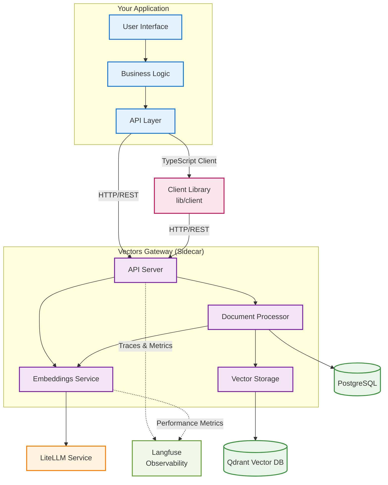

# Vectors Gateway <!-- omit in toc -->

A **Sidecar service** for applications that need vector database functionality to augment their LLMs. This service provides embeddings and retrieval capabilities by abstracting embeddings generation (LiteLLM) and vector storage and search (Qdrant).

- [What is this service?](#what-is-this-service)
  - [Key Characteristics](#key-characteristics)
  - [Use Cases](#use-cases)
- [Deployment Pattern](#deployment-pattern)
- [Integration Methods](#integration-methods)
  - [Option 1: TypeScript/JavaScript Client Library](#option-1-typescriptjavascript-client-library)
  - [Option 2: Direct API Integration](#option-2-direct-api-integration)
  - [Client Library Features](#client-library-features)
  - [How It Works](#how-it-works)
- [Observability \& Distributed Tracing](#observability--distributed-tracing)
  - [Langfuse Integration](#langfuse-integration)
  - [Distributed Tracing](#distributed-tracing)
    - [Trace Headers](#trace-headers)
- [Development, Contributing and Deployment](#development-contributing-and-deployment)
  - [API](#api)
  - [Environment Variables](#environment-variables)
  - [Database Management](#database-management)
    - [Database Migration Lifecycle](#database-migration-lifecycle)
      - [Production Environment](#production-environment)
      - [Development Environment](#development-environment)
  - [Deployment](#deployment)

## What is this service?

This service is designed to be deployed alongside your main application as a companion service. It provides vector database functionality without requiring your main application to handle the complexity of:

- Document chunking and processing
- Embedding generation via LiteLLM
- Vector storage and retrieval via Qdrant
- Metadata management and data isolation

### Key Characteristics

- **Single-tenant**: Designed for one-to-one deployment with your application
- **Focused responsibility**: Handles only vector database operations
- **API-driven**: Communicates with your application via REST API
- **Intelligent Processing**: Uses semantic chunking for optimal document understanding
- **Full Observability**: Built-in distributed tracing and comprehensive monitoring
- **Enterprise-Grade**: Production-ready with complete observability and distributed context propagation

### Use Cases

This service is a good fit for applications that need to:

- **RAG (Retrieval-Augmented Generation)**: Store and retrieve relevant documents to augment LLM responses
- **Semantic Search**: Find similar content based on meaning, not just keywords
- **Document Management**: Process and store documents with intelligent semantic chunking
- **Knowledge Bases**: Build searchable knowledge repositories for your application
- **Large Document Processing**: Handle documents up to 50MB with semantic chunking for optimal search quality

## Deployment Pattern



**Key Points:**
- **Sidecar Pattern**: Vectors Gateway runs alongside your application
- **Two Integration Options**: Use the TypeScript client library or direct API calls
- **Single Responsibility**: Your app handles business logic, Vectors Gateway handles vector operations
- **Complete Observability**: All operations are tracked and monitored through Langfuse
- **Distributed Tracing**: Full request context maintained across service boundaries
- **Data Isolation**: All operations are isolated by userId, knowledgeBaseId, and documentId

## Integration Methods

### Option 1: TypeScript/JavaScript Client Library

For TypeScript/JavaScript applications, you can use the included client library:

```typescript
import { VectorsGatewayClient } from '@url4irl/vectors-gateway';

const client = new VectorsGatewayClient('your-api-key', 'http://my-vectors-gateway-url');

// Store a document
const response = await client.storeDocument(
  'Your document content here',
  123, // userId
  456, // knowledgeBaseId
  789  // documentId
);

// Search across knowledge base
const results = await client.searchKnowledgeBase(
  'machine learning algorithms',
  123, // userId
  456, // knowledgeBaseId
  { limit: 10, scoreThreshold: 0.8 }
);

// Search within specific document
const docResults = await client.searchInDocument(
  'neural networks',
  123, // userId
  456, // knowledgeBaseId
  789, // documentId
  { limit: 5 }
);

// Delete a document
await client.deleteDocument(789, 123, 456);

// Check service health
const health = await client.healthCheck();
```

### Option 2: Direct API Integration

For other languages or direct API usage, use the OpenAPI specification.

**OpenAPI Specification**: Available at `/docs` when the service is running, or see [`openapi.json`](./openapi.json) for the complete specification.

### Client Library Features

The included TypeScript client library provides:

- **Type Safety**: Full TypeScript support with Zod validation
- **Method Chaining**: Intuitive API with methods like `searchKnowledgeBase()`, `searchInDocument()`
- **Error Handling**: Built-in error handling with descriptive messages
- **Request Validation**: Automatic validation of request parameters
- **Health Monitoring**: Built-in health check and service info methods
- **Explicit Configuration**: Required base URL and API key parameters for clear configuration

### How It Works

As a Sidecar service, the Vectors Gateway operates as follows:

1. **API Communication**: Your main application communicates with this service via REST API calls
2. **Authentication**: All requests require an API key for security and data isolation
3. **Document Processing**: When your app needs to store documents:
   - Documents are automatically chunked using **semantic chunking** for optimal content understanding
   - Each chunk is embedded through LiteLLM
   - Vectors are stored in Qdrant with metadata in PostgreSQL
4. **Semantic Search**: When your app needs to retrieve relevant content:
   - Query is embedded using the same model
   - Similar vectors are found in Qdrant
   - Results are returned with similarity scores
5. **Data Isolation**: All operations are isolated by `userId`, `knowledgeBaseId`, and `documentId`
6. **Flexible Search Scope**:
   - **Knowledge Base Level**: Search across all documents in a knowledge base
   - **Document Level**: Search within a specific document
   - **Configurable Scoring**: Adjustable similarity threshold (default: 0.5)

## Observability & Distributed Tracing

The Vectors Gateway includes comprehensive observability features powered by **Langfuse** and **distributed tracing** to provide complete visibility into your vector operations.

### Langfuse Integration

The service automatically tracks and monitors all operations through Langfuse:

- **Document Processing Pipeline**: Complete visibility into document ingestion, chunking, embedding generation, and vector storage
- **Search Operations**: Track query embedding, vector similarity search, and result ranking
- **Performance Metrics**: Monitor embedding generation time, storage performance, and search latency
- **Error Tracking**: Comprehensive error logging with full context and stack traces
- **User Analytics**: Track usage patterns, document processing volumes, and search performance per user

### Distributed Tracing

The service implements **Distributed Tracing**, allowing you to:

- **Track requests across service boundaries**
- **Maintain request context through the entire call chain** 
- **Correlate logs and metrics across multiple services**
- **Debug complex distributed systems**

The service supports distributed tracing to maintain request context across service boundaries:

#### Trace Headers

The service supports multiple trace header formats for maximum compatibility:

- **`x-trace-id`**: Primary trace ID header
- **`x-b3-traceid`**: B3 format (Zipkin compatibility)
- **`traceparent`**: OpenTelemetry format
- **`x-span-id`**: Span ID for nested operations
- **`x-parent-trace-id`**: Parent trace context

## Development, Contributing and Deployment

```bash
pnpm install
pnpm dev
# Service will run on http://localhost:4000
```

This starts the Express app and some Docker services (see `dev/docker-compose.yml`).

OpenAPI is served by `lib/docs.ts` from `openapi.json`. Update the JSON file when changing endpoints.

You'll need a running LiteLLM instance (with embeddings support), Qdrant and a Postgres database. The provided Docker Compose file for local development includes a PostgreSQL database and Qdrant instance.

### API

Swagger UI is available at `/docs` when service is running. OpenAPI spec: [`openapi.json`](./openapi.json).

### Environment Variables

- `PORT` (default: 4000)
- `NODE_ENV` (default: development)
- `API_KEY` (required) - API key for authentication
- `LITELLM_BASE_URL` (e.g., http://localhost:4000 for your LiteLLM proxy)
- `LITELLM_API_KEY` (you must generate an API key from your LiteLLM instance)
- `QDRANT_URL` (default: http://localhost:6333)
- `QDRANT_API_KEY` (optional)
- `QDRANT_COLLECTION_NAME` (default: documents)
- `DEFAULT_EMBEDDING_MODEL` (default: openai/bge-m3:latest. Note, this is not an OpenAI model, it's a model from BAAI. It is prefixed with openai/ to inform LiteLLM to use the OpenAI API format (via Ollama).)
- `LANGFUSE_PUBLIC_KEY` (required) - Your Langfuse public key
- `LANGFUSE_SECRET_KEY` (required) - Your Langfuse secret key
- `LANGFUSE_BASE_URL` (required) - Langfuse instance URL

### Database Management

#### Database Migration Lifecycle

##### Production Environment

Database migrations are managed using Drizzle ORM. In a production environment, migrations must be applied **manually** by accessing the running container and executing the following command within it:

```bash
pnpm drizzle-kit migrate --config ./dist/drizzle.config.js
```

This command will apply any pending schema changes to the database. Ensure you run this command after any deployment that includes database schema modifications.

##### Development Environment

In development, create and apply migrations using:

```bash
pnpm run db:generate # Generates a new migration file
pnpm run db:migrate # Applies the migration to the database
```

### Deployment

When code changes are pushed to the repository, the container is rebuilt and the updated service is deployed.

Use the [Dockerfile](./Dockerfile) to deploy this service to wherever you want.

All the environment variables are documented in the [Environment Variables](#environment-variables) section are required.

This service needs a running LiteLLM instance, Qdrant and a Postgres database.

Contributions are always welcome ❤️
