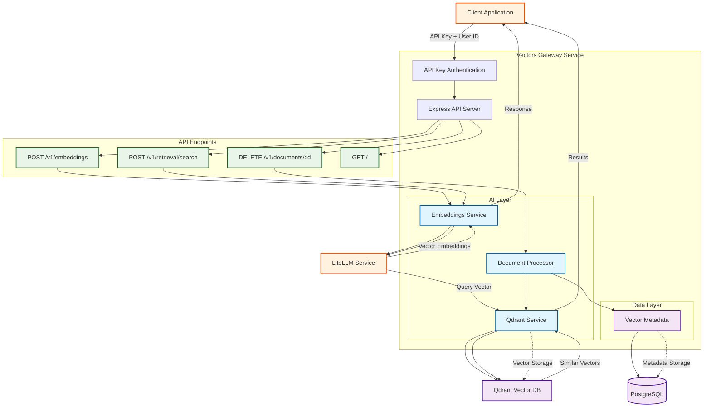

# Vectors Gateway <!-- omit in toc -->

Embeddings and retrieval API that abstracts LiteLLM (embeddings) and Qdrant (vector search).

- [Architecture](#architecture)
  - [How It Works](#how-it-works)
- [Quick Start](#quick-start)
- [API](#api)
- [Environment Variables](#environment-variables)
- [Database Management](#database-management)
  - [Database Migration Lifecycle](#database-migration-lifecycle)
    - [Production Environment](#production-environment)
    - [Development Environment](#development-environment)
- [Deployment](#deployment)

## Architecture



### How It Works

1. **Authentication**: All requests require an API key and user ID for security and data isolation
2. **Embeddings API**: Direct text-to-vector conversion using LiteLLM (no document storage)
3. **Retrieval API**: Direct semantic search using LiteLLM + Qdrant with flexible search scope:
   - **Knowledge Base Level**: Search across all documents in a knowledge base
   - **Document Level**: Search within a specific document (optional `documentId` parameter)
4. **Document Management**: Document Processor handles document deletion with proper cleanup:
   - **Deletion**: Removes documents and cleans up all associated data across Qdrant and PostgreSQL
5. **Storage**: Vectors are stored in Qdrant with metadata in PostgreSQL
6. **Data Integrity**: Document operations maintain consistency across both storage systems

## Quick Start

```bash
pnpm install
pnpm dev
# Service will run on http://localhost:4000
```

This starts the Express app and some Docker services (see `dev/docker-compose.yml`).

OpenAPI is served by `lib/docs.ts` from `openapi.json`. Update the JSON file when changing endpoints.

You'll need a running LiteLLM instance (with embeddings support), Qdrant and a Postgres database. The provided Docker Compose file for local development includes a PostgreSQL database and Qdrant instance.

## API

Swagger UI is available at `/docs` when service is running. OpenAPI spec: [`openapi.json`](./openapi.json).

## Environment Variables

- `PORT` (default: 4000)
- `API_KEY` (required) - API key for authentication
- `LITELLM_BASE_URL` (e.g., http://localhost:4000 for your LiteLLM proxy)
- `LITELLM_API_KEY` (you must generate an API key from your LiteLLM instance)
- `QDRANT_URL` (default: http://localhost:6333)
- `QDRANT_API_KEY` (optional)
- `QDRANT_COLLECTION_NAME` (default: documents)
- `DEFAULT_EMBEDDING_MODEL` (default: openai/bge-m3:latest)

## Database Management

### Database Migration Lifecycle

#### Production Environment

Database migrations are managed using Drizzle ORM. In a production environment, migrations must be applied **manually** by accessing the running container and executing the following command within it:

```bash
pnpm drizzle-kit migrate --config ./dist/drizzle.config.js
```

This command will apply any pending schema changes to the database. Ensure you run this command after any deployment that includes database schema modifications.

#### Development Environment

In development, create and apply migrations using:

```bash
pnpm run db:generate # Generates a new migration file
pnpm run db:migrate # Applies the migration to the database
```

## Deployment

When code changes are pushed to the repository, the container is rebuilt and the updated service is deployed.

Contributions are always welcome ❤️
